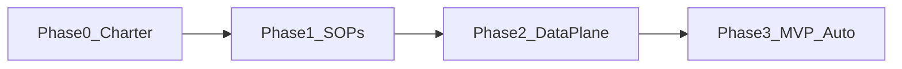

# Initial phases (roadmap)

Phases are **sequential**: each phase produces artifacts the next phase depends on (written SOPs before automation, inventory before integrations).

| Phase | Name | Goal |
|-------|------|------|
| 0 | [Charter and scope](phase-0-charter-and-scope.md) | Agree what “SOC” means here, human vs machine roles, non-goals. |
| 1 | [Knowledge and SOPs](phase-1-knowledge-and-sops.md) | Turn training (e.g. TryHackMe) and internal policy into documented playbooks. |
| 2 | [Technical foundation](phase-2-technical-foundation.md) | Log sources, lab/simulation, integration inventory, repo layout for code. |
| 3 | [MVP automation](phase-3-mvp-automation.md) | One alert type (or one synthetic scenario) from signal → decision → action with audit trail. |

**Status:** fill the `Status` line at the top of each phase file as you progress (`not_started` | `in_progress` | `done`).
